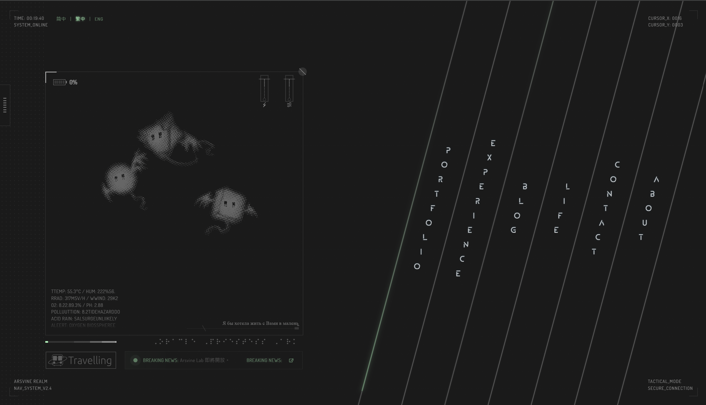

# ARSVINE REALM

ARSVINE REALM is a personal portfolio and blog site built around a post-apocalyptic HUD visual language. It presents works, experience, life records, blog posts, tweets, friend links, contact/about pages, music playback, animated transitions, client-only WebGL atmosphere, and TOTP-protected private posts.



## Status

- **Project type:** personal site, not a generic template
- **Owner:** Arsvine Zhu
- **Stack:** Next.js 16 Pages Router, React 18, TypeScript, SCSS Modules, Three.js, GSAP, MDX, `next-intl` 4, Vitest, custom Node.js server
- **Runtime target:** Node.js `24.x`
- **UI locales:** `zh-CN`, `zh-TW`, `en`
- **Public route shape:** `/<locale>/...`

## Documentation map

This README is only the entry point. Detailed maintenance information is split by purpose:

| Document | Purpose |
|---|---|
| [`docs/DEVELOPMENT.md`](./docs/DEVELOPMENT.md) | Local setup, commands, scripts, COS Referer workflow, fonts, images, music, and daily maintenance. |
| [`docs/ARCHITECTURE.md`](./docs/ARCHITECTURE.md) | Router structure, content sources, protected-post flow, API routes, transitions, styling, and 3D effects. |
| [`docs/OPERATIONS.md`](./docs/OPERATIONS.md) | Deployment, environment variables, analytics, CDN/COS operations, ISR, Upstash, SEO files, and operational checks. |
| [`docs/GOTCHAS.md`](./docs/GOTCHAS.md) | Historical bugs and fragile conventions that should not be reintroduced. |
| [`CLAUDE.md`](./CLAUDE.md) | Short instruction index for coding agents. It should stay concise and point to the documents above. |

## Quick start

```bash
pnpm install
cp .env.example .env.local
pnpm dev
```

Open `http://localhost:3000`. The middleware redirects the root path to a locale-prefixed route such as `/zh-CN`.

## Common commands

```bash
pnpm dev           # node server.js
pnpm build         # next build
pnpm start         # cross-env NODE_ENV=production node server.js
pnpm lint          # eslint .
pnpm typecheck     # tsc --noEmit
pnpm test          # vitest run
pnpm check         # lint + typecheck + test + build
```

Run a single Vitest file or filter by case name:

```bash
pnpm vitest run lib/blog-client.test.ts
pnpm vitest run -t "reading time"
```

## Core features

- HUD-style home page with five primary navigation columns.
- Unified animated navigation through `TransitionContext`; internal navigation should use `useTransition().navigateTo()`.
- Trilingual UI through `next-intl` and locale-prefixed routing.
- Content aggregation page at `/<locale>/content` with hash sections.
- Blog detail pages using SSG, `fallback: 'blocking'`, and ISR.
- Runtime blog/tweet loading from an external private GitHub content repository when configured (`blog-index.json`, `blog/<slug>/<locale>.mdx`, `tweets/index.json`, `tweets/YYYY-MM.json`).
- Tweets archive page with month pagination and a development-only synthetic stress mode.
- TOTP-protected posts that do not ship protected MDX in static props or `_next/data` JSON.
- Self-hosted Google Fonts and media assets served from Tencent COS through `cdn.arsvine.com`.
- Desktop-only WebGL/Three.js atmosphere effects loaded with SSR disabled.
- Dynamic `sitemap.xml`, per-locale RSS, and `robots.txt`.

## Project structure

```text
components/          # page components, layout, cards, MDX components, effects, interactions
config/              # small runtime config fragments, e.g. image host allowlist
content/blog/init/   # bundled fallback post when external content repo is unavailable
contexts/            # AppContext, TransitionContext, LayoutAnchorsContext
data/                # trilingual data, site config, music playlist
docs/                # documentation and handoff notes
hooks/               # custom React hooks
i18n/                # next-intl config and request setup
lib/                 # business logic: blog, content access, tweets, reducers, geometry, utilities
locales/             # UI translation JSON
pages/               # Next.js Pages Router routes and API routes
public/              # static assets, icons, local music test folder
scripts/             # image, font, favicon, and local-host helpers
styles/              # global SCSS and module partials
types/               # shared TypeScript types
server.js            # custom Next.js server
```

## Configuration entry points

Routine maintenance should start from data/config files rather than component logic:

- `data/site.ts` — site identity, SEO text, fonts, social links, page-level labels.
- `data/music.ts` — music playlist.
- `data/<topic>/{index.ts,en.ts,zh-TW.ts}` — trilingual structured data.
- `locales/{zh-CN,zh-TW,en}.json` — UI strings.
- `config/image-hosts.js` — Next.js remote image host allowlist.
- `.env.example` — documented environment variables.

## Deployment

```bash
pnpm build
pnpm start
```

Or with a process manager:

```bash
pm2 start server.js --name arsvine-realm
```

Set at least:

```env
NODE_ENV=production
NEXT_PUBLIC_SITE_URL=https://arsvine.com
```

For Vercel, keep the Node.js setting aligned with `package.json`'s `engines.node` value: `24.x`.

## License and content policy

- Source code: [MIT License](./LICENSE)
- Original site content, writing, images, notes, and design assets: CC BY-NC-ND 4.0

The full bilingual license text is available on the site copyright page.
